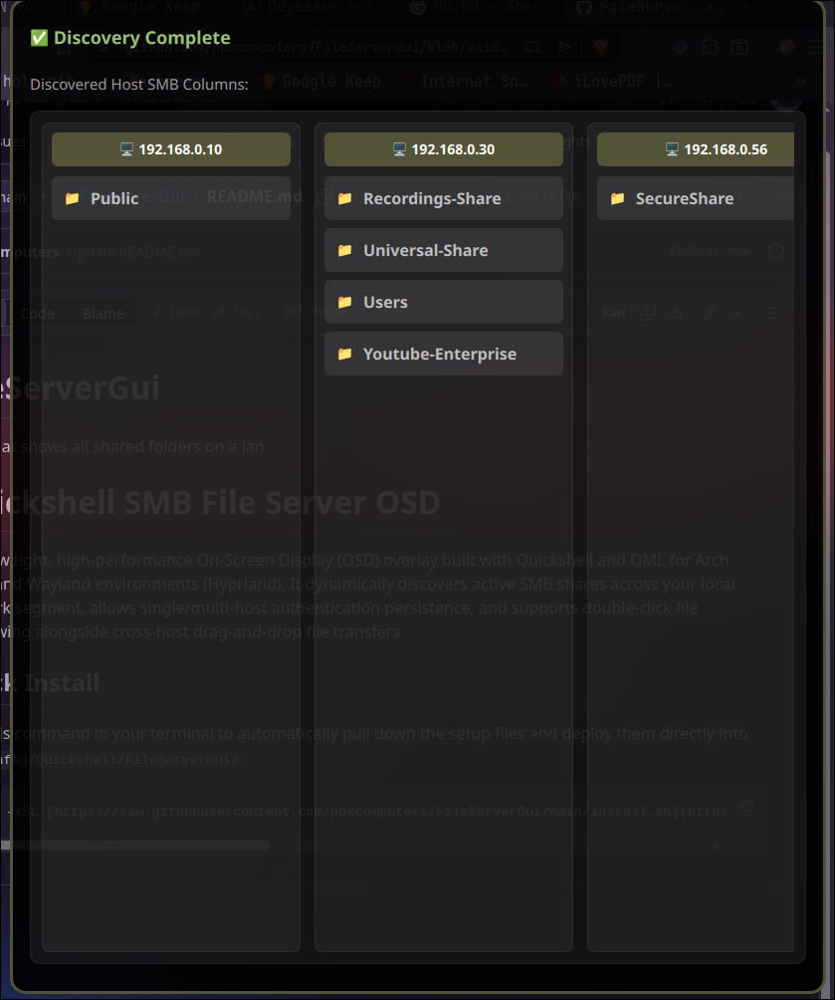

# FileServerGui
OSD that shows all shared folders on a lan
# Quickshell SMB File Server OSD



A lightweight, high-performance On-Screen Display (OSD) overlay built with Quickshell and QML for Arch Linux and Wayland environments (Hyprland). It dynamically discovers active SMB shares across your local network segment, allows single/multi-host authentication persistence, and supports double-click file previewing alongside cross-host drag-and-drop file transfers.

## hyprland.lua keybinding 
hl.bind("SUPER + L", hl.dsp.exec_cmd("~/.config/Quickshell/FileServerGui/toggle.sh")) 

## Quick Install

Run this command in your terminal to automatically pull down the setup files and deploy them directly into `~/.config/Quickshell/FileServerGui/`:

```bash
curl -sSL [https://raw.githubusercontent.com/ppkcomputers/FileServerGui/main/install.sh](https://raw.githubusercontent.com/ppkcomputers/FileServerGui/main/install.sh) -o /tmp/install.sh && zsh /tmp/install.sh && rm /tmp/install.sh

